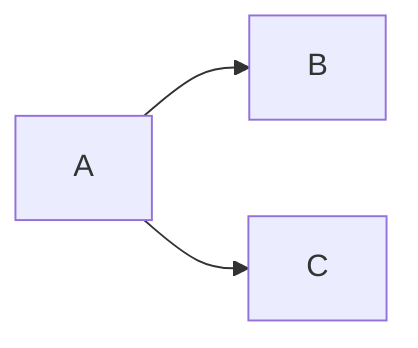

# ML TOOLS
This is a collection of implemented ML tools ->
from data encoders and a processing pipeline to supervised learning using 
Scaled Conjugate Gradient & Relative Weights, and clustering using 
Parameterless Self Organizing Maps and Centroid NN

Implemented in Numpy & Scipy:
Scaled Conjugate Gradient (SCG) regression & Classification
Scaled Conjugate Gradient SCG regression with elasticnet regularization
Scaled Conjugate Gradient SCG classification, binary, multinomial and 
multilabel
Johnson's Relative Weights (RW) regression
Johnson's Relative Weights (RW) applied to logistic regressions 
(classificaiton)
Parameterless Self Organizing Maps (PLSOM) for clustering and dimension 
reduction
Centroid Neural Network (CENTNN) for quick clustering and optimization 
using silhouette score

https://packaging.python.org/en/latest/tutorials/packaging-projects/

https://packaging.python.org/en/latest/tutorials/creating-documentation/

# Visuals & Diagrams
https://mermaid.js.org/config/Tutorials.html
