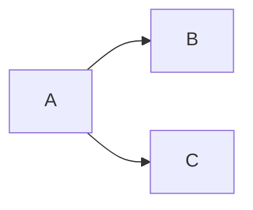

# ML TOOLS

---

## Overview

**ML Tools** is a collection of implemented machine learning methods ranging from  
data encoding and processing pipelines to supervised learning and clustering.

The focus of this repository is:
- **Classic and alternative ML algorithms implemented with a unified 
  interface**
- **Numerical stability and performance**
- **Novel extensions and original research contributions**

All algorithms are implemented in **NumPy** and **SciPy**, with minimal external dependencies.

---
## Implemented Methods

### 🔹 Encoding and Embedding Creation
`src/ml_tools/encoders/*`
- Categorical variable pipeline
- Chronological variable (cyclical and absolute) pipeline
- Numeric (normalized and raw) pipeline
- Trainable Fourier Embedding pipeline
- Trainable Text embedding pipeline

### 🔹 Toy Dataset Generation
`src/ml_tools/generators/*`

### 🔹 Supervised Learning
`src/ml_tools/models/supervised/*`
#### Scaled Conjugate Gradient (SCG)
- SCG for gradient descent applied to regression and logistic regression 
  *(Møller); (Anderson)*
- SCG regression with **Elastic Net regularization** *(novel)*
- SCG classification:
  - Binary
  - Multinomial
  - Multilabel

#### Relative Weights (RW)
- Johnson’s Relative Weights regression *(Johnson)*
- Relative Weights applied to logistic regression  
  *(Solís & Pasquier); (Tonidandel & LeBreton)*

### 🔹 Unsupervised Learning & Clustering
`src/ml_tools/models/clustering/*`
#### Self-Organizing Maps
- Self Organizing Maps, Parameterless Self-Organizing Maps - PLSOM  
  *(Kohonen); (Berglund & Sitte)*
  - Clustering and dimensionality reduction without hyperparameter adjustment

#### Centroid Neural Networks (CENTNN)
- Novel **Centroid Neural Network** for fast clustering and optimization  
  *(Park, Dong-Chul)*
- CENTNN with **N-dimensional density modeling**
- *(novel)*

---
## Status

**Active research / experimental**  
APIs may change as methods are refined and extended.

---
## References

Primary academic references are cited inline.  
Full bibliographic references may be added in `/docs` in the future.

https://packaging.python.org/en/latest/tutorials/packaging-projects/

https://packaging.python.org/en/latest/tutorials/creating-documentation/

# Visuals & Diagrams
https://mermaid.js.org/config/Tutorials.html
